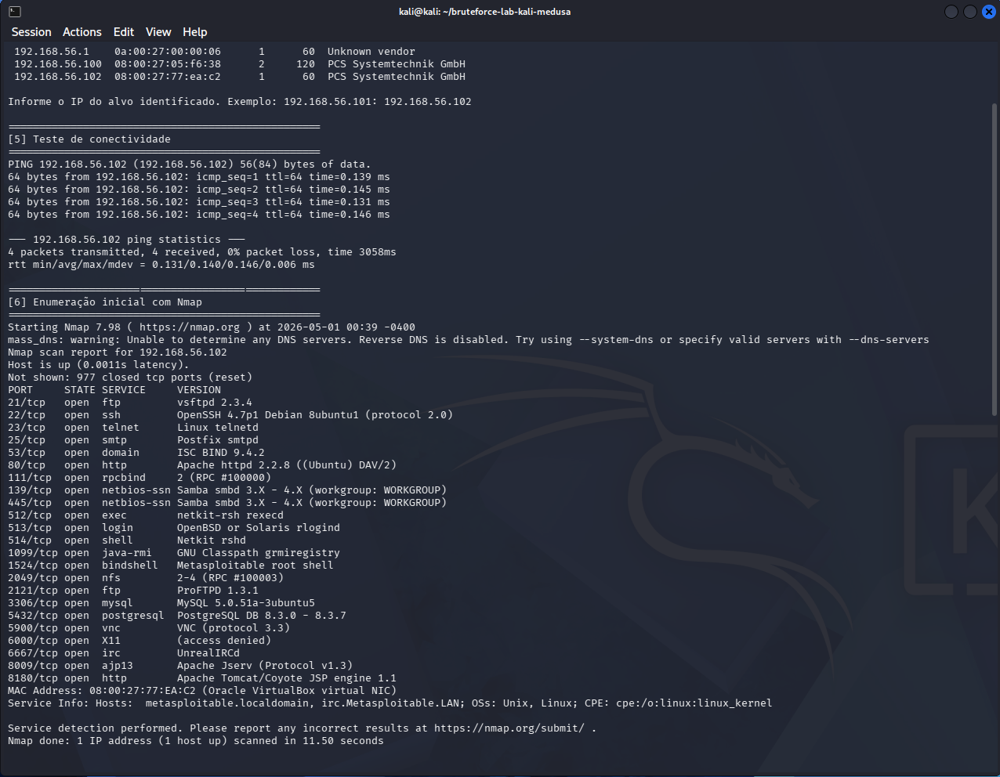
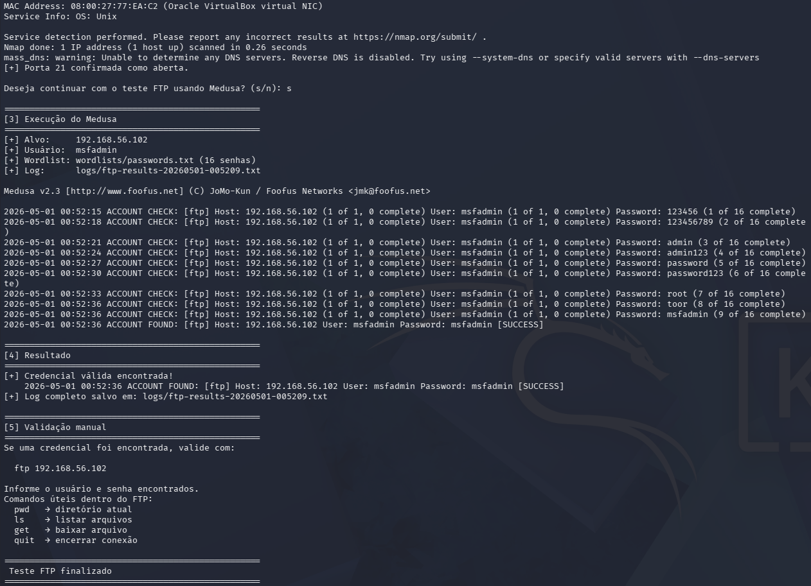
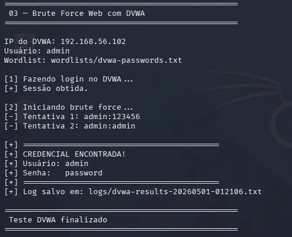
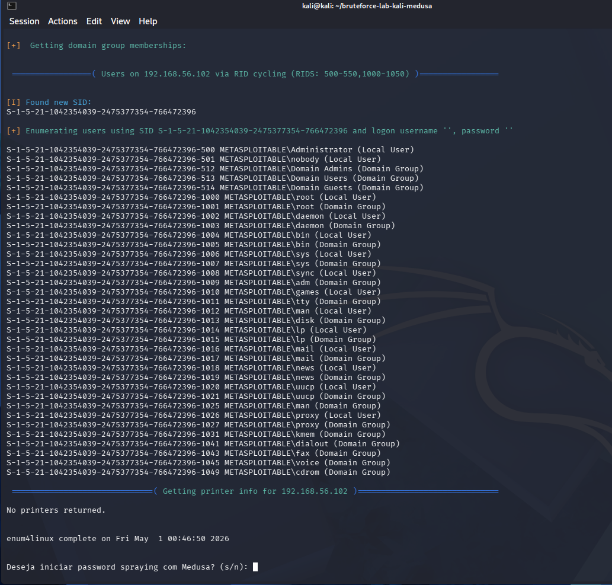

# 🔐 Brute Force Lab — Kali Linux & Medusa

Simulação prática de ataques de força bruta em ambiente controlado utilizando Kali Linux, Medusa e aplicações intencionalmente vulneráveis (Metasploitable 2 e DVWA).

---

## 📌 1. Contexto e Objetivo

Este projeto demonstra, na prática, como ataques de força bruta funcionam em diferentes serviços e como podem ser detectados e mitigados.

O foco não é apenas executar ataques, mas **entender o mecanismo, o impacto e as defesas reais utilizadas no mercado**.

---

## 🎯 Objetivos Técnicos

- Simular ataques de força bruta em FTP, aplicação web (DVWA) e SMB
- Utilizar ferramentas reais de pentest (Medusa, enum4linux-ng, Nmap, Burp Suite)
- Validar acessos obtidos com evidências documentadas
- Propor mitigações baseadas em boas práticas de mercado

---

## 🧱 2. Arquitetura do Ambiente

```
┌─────────────────────┐        Host-Only Network         ┌─────────────────────────┐
│    Kali Linux       │ ─────────────────────────────── │    Metasploitable 2     │
│  192.168.56.100     │                                  │    192.168.56.101       │
│   (Atacante)        │                                  │    (Alvo)               │
│                     │                                  │                         │
│  - Medusa           │                                  │  - FTP  (porta 21)      │
│  - Nmap             │                                  │  - SMB  (porta 445)     │
│  - enum4linux-ng    │                                  │  - DVWA (porta 80)      │
│  - Burp Suite       │                                  │                         │
└─────────────────────┘                                  └─────────────────────────┘
```

### Justificativa da Rede Host-Only

- Isolamento total do ambiente externo
- Evita tráfego malicioso na rede real
- Permite comunicação controlada entre VMs

---

## ⚙️ 3. Configuração do Ambiente

### Etapas executadas:

1. Importação das VMs no VirtualBox
2. Configuração de rede como **Host-Only Adapter** em ambas as VMs
3. Descoberta de IP da máquina alvo:

```bash
sudo netdiscover -r 192.168.56.0/24
```

4. Enumeração inicial de serviços:

```bash
nmap -sV -p 21,22,80,139,445 192.168.56.101
```

**Resultado da enumeração:**



---

## ⚔️ 4. Ataque de Força Bruta em FTP

### Ferramenta: Medusa

### Comando utilizado:

```bash
medusa -h 192.168.56.101 -u msfadmin -P wordlists/passwords.txt -M ftp -O logs/ftp-results.txt
```

### Parâmetros explicados:

| Parâmetro | Função |
|---|---|
| `-h` | Endereço IP do alvo |
| `-u` | Usuário fixo a testar |
| `-P` | Arquivo com lista de senhas |
| `-M ftp` | Módulo FTP do Medusa |
| `-O` | Salva resultado em arquivo de log |

### Resultado:

Credencial válida identificada. Acesso FTP autenticado com sucesso.



---

## 🌐 5. Ataque no DVWA (Web Brute Force)

### Ferramentas: curl + Burp Suite

### Estratégia:

1. Interceptação da requisição via Burp Suite para identificar parâmetros e CSRF token
2. Extração do `user_token` para cada requisição
3. Repetição automatizada com lista de senhas

### Ponto crítico identificado:

Aplicações web sem rate limiting permitem brute force irrestrito — vulnerabilidade grave e comum.

> **Nota técnica:** O DVWA em versões recentes exige o `user_token` (proteção CSRF) mesmo no nível `low`. O script `03-dvwa-bruteforce.sh` realiza a extração automática desse token antes de cada tentativa.



---

## 🖥️ 6. Ataque SMB + Password Spraying

### Ferramentas: enum4linux-ng + Medusa

### Enumeração de usuários:

```bash
# Ferramenta moderna (recomendada)
enum4linux-ng -A 192.168.56.101

# Alternativa legada
enum4linux -a 192.168.56.101
```

### Ataque password spraying:

```bash
medusa -h 192.168.56.101 -U wordlists/users.txt -p "123456" -M smbnt -O logs/smb-results.txt
```

### Por que password spraying é mais perigoso que brute force puro?

| Técnica | Velocidade | Risco de Lockout | Detecção | Eficiência em Redes Corporativas |
|---|---|---|---|---|
| Brute Force | Alta | Alto | Fácil | Baixa |
| Password Spraying | Baixa/Moderada | Baixo | Difícil | Alta |
| Credential Stuffing | Alta | Variável | Moderada | Alta |

Password spraying testa **uma senha em muitos usuários**, evitando o bloqueio de conta — técnica prevalente em ataques reais a ambientes Active Directory.



---

## 🧠 7. Vulnerabilidades Exploradas

Principais falhas identificadas no ambiente:

- Senhas fracas ou previsíveis
- Ausência de rate limiting nos serviços
- Falta de bloqueio após tentativas falhas
- Serviços legados expostos (FTP, SMBv1)
- Enumeração anônima habilitada no SMB
- Ausência de monitoramento de autenticação

---

## 🛡️ 8. Medidas de Mitigação

### Controles recomendados:

| Controle | Descrição | Impacto |
|---|---|---|
| Rate Limiting | Limitar tentativas por IP/usuário | Alto |
| Account Lockout | Bloquear após X falhas com desbloqueio progressivo | Alto |
| MFA | Elimina dependência exclusiva de senha | Crítico |
| SIEM / Alertas | Detectar padrões anômalos de autenticação | Alto |
| Hardening | Desabilitar FTP simples, SMBv1, enumeração anônima | Médio |
| Hashing seguro | bcrypt / argon2 para senhas armazenadas | Alto |

---

## 📊 9. Conclusão

Este projeto demonstrou que:

- Ataques de força bruta continuam eficazes em ambientes mal configurados
- A maioria das vulnerabilidades está relacionada a **falhas básicas de autenticação**
- Password spraying é significativamente mais difícil de detectar que brute force tradicional
- Medidas simples como MFA e rate limiting reduzem drasticamente o risco

---

## 📁 Estrutura do Projeto

```
bruteforce-lab/
│
├── README.md
├── docs/
│   ├── 01-setup.md
│   ├── 02-ftp-attack.md
│   ├── 03-dvwa-attack.md
│   ├── 04-smb-attack.md
│   └── 05-mitigations.md
├── wordlists/
│   ├── users.txt
│   ├── passwords.txt
│   ├── ftp-users.txt
│   ├── smb-users.txt
│   └── dvwa-passwords.txt
├── scripts/
│   ├── 01-setup-discovery.sh
│   ├── 02-ftp-medusa.sh
│   ├── 03-dvwa-bruteforce.sh
│   ├── 04-smb-spraying.sh
│   └── 05-basic-hardening-checklist.sh
├── logs/
│   └── .gitkeep
└── images/
    ├── nmap-scan.png
    ├── ftp-success.png
    ├── dvwa-bruteforce.png
    └── smb-enum.png
```

---

## 🚀 Próximos Passos

- Análise comparativa de tempo de execução entre Hydra e Medusa para FTP
- Automatizar correlação de logs com regras SIEM (Wazuh/ELK)
- Expandir laboratório para ataques em SSH e RDP
- Simular detecção ativa com fail2ban configurado no alvo

---

## ⚠️ Aviso Legal

Este projeto foi desenvolvido **exclusivamente para fins educacionais** em ambiente isolado e controlado.

Qualquer uso contra sistemas sem autorização expressa é ilegal e antiético.

---

## 👨‍💻 Autor

Projeto desenvolvido como prática em Cybersecurity — segurança ofensiva e defensiva.

---

## 📚 Documentação Técnica

- [01 — Configuração do Ambiente](docs/01-setup.md)
- [02 — Ataque FTP com Medusa](docs/02-ftp-attack.md)
- [03 — Brute Force Web com DVWA](docs/03-dvwa-attack.md)
- [04 — SMB e Password Spraying](docs/04-smb-attack.md)
- [05 — Mitigações](docs/05-mitigations.md)
